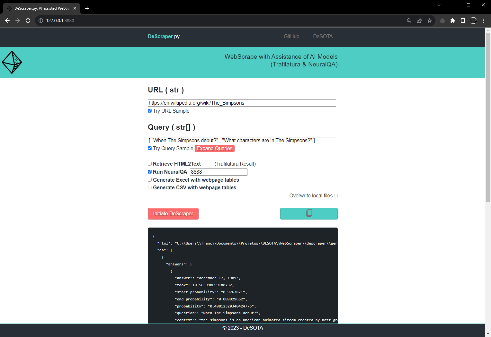
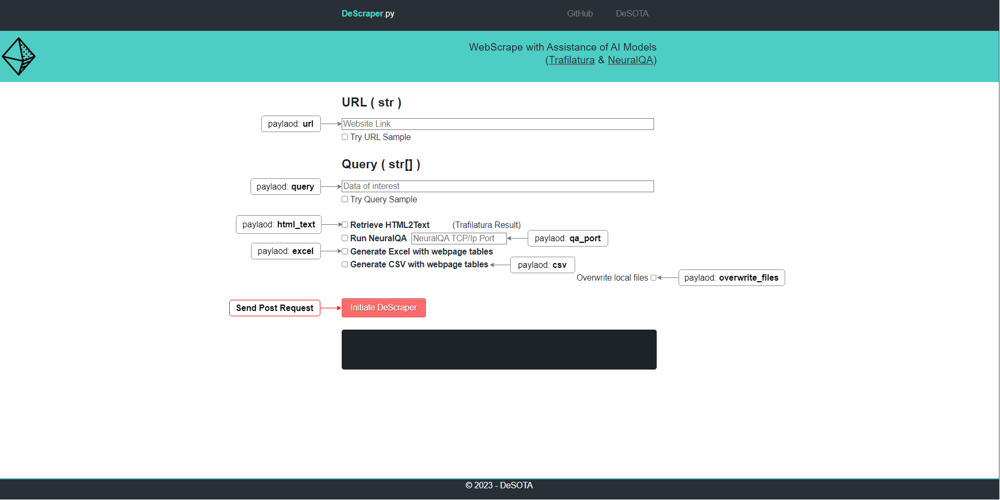
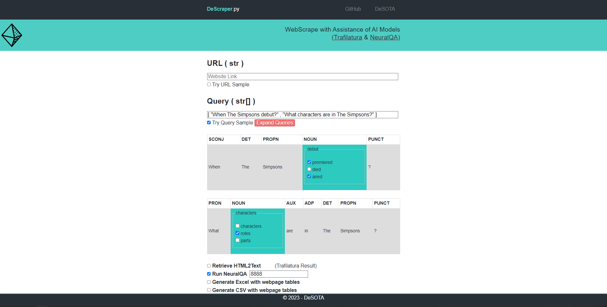
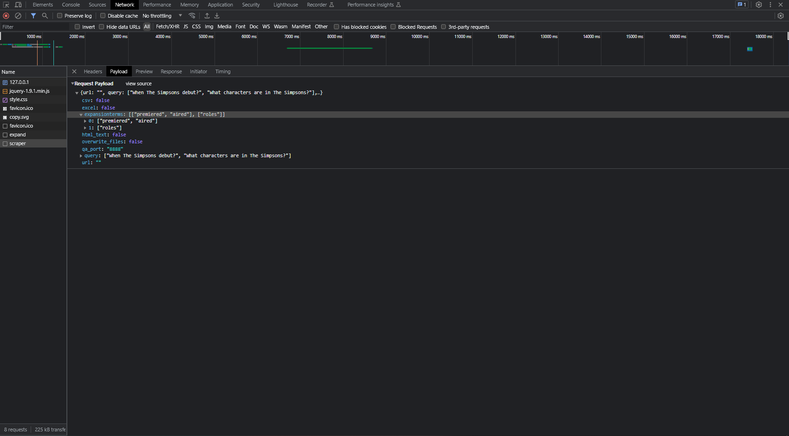

# About DeScraper



## Description
This project purpose is:
 - Connect with the AI models [NeuralQA](https://github.com/victordibia/neuralqa/) (Large Datasets Question Answer) and [Trafilatura](https://github.com/adbar/trafilatura/) (HTML2Text);
 - Generate HTML tables in Excel and/or CSV format with pandas.read_html.

## How it works
### After:
  - Install:
    - [DeScraper](#instalation);
    - [NeuralQA](https://github.com/franciscomvargas/neuralqa#instalation).

  - Start API Servers:
    - [DeScraper](#run);
    - [NeuralQA](https://github.com/franciscomvargas/neuralqa#run).
  
### Make your first request:

<details>
  <summary>By POST Request</summary>

You can use any programing language to make this request, I will use Python to ilustrate how you can do it:

[Payload Explanation](#documentation)
```python
import requests

descraper_url = "http://127.0.0.1:8880/api/scraper"

payload = {
    "url": "https://en.wikipedia.org/wiki/The_Simpsons",
    "html_text": True,
    "query": ["When the simpsons debut?"],
    "qa_port": 8888,
    "expansionterms": [],
    "excel": True,
    "csv": True,
    "overwrite_files": False
}

response = requests.request("POST", descraper_url, json=payload)

print(response.json())
```

</details>

<details>
  <summary>By User Interface</summary>

 - [Open UI in the browser](#run)
 - Fill with [payload](#documentation) parameters:



</details>

### Documentation
<details>
  <summary>Payload Explanation</summary>

|Parameter|Type|Optional|Description|
|---|---|---|---|
|url|string|&cross;|The link of the website to webscrape|
|html_text|bolean|&check;|Run Trafilatura - get text from webpage|
|query|array of strings|&check;|When running NeuralQA is required to specify what data you want to retrieve|
|qa_port|integer|&check;|NeuralQA is a TCP/Ip service runing in paralel, here is possible to specify it's Port. Default is 8888|
|expansionterms|array of strings for each query|&check;|NeuralQA have the ability to expand queries in order to improve the results. This by adding expansion terms (keywords) in the NeuralQA request. To get the expansion terms you need to make a perliminar POST request to "http://127.0.0.1:8880/api/expand" with the simple payload {query: [array of queries]}. Get a full grasp of this funtionality with the [NeuralQA Query Expansion](#documentation)|
|excel|bolean|&check;|Generate Excel File with webpage tables|
|csv|bolean|&check;|Generate CSV Files with webpage tables|
|overwrite_files|bolean|&check;|DeScraper stores locally the scraped HTML pages and the Generated Tables, therefore, everytime you re-request the same URL you can overwrite the files switching ON this parameter (for example if the webpage has been updated)|
</details>

<details>
  <summary>NeuralQA Query Expansion</summary>

 - Explanation:
   - First, a set of rules are used to determine which token in the query to expand. These rules are chosen to improve recall (surface relevant queries) without altering the semantics of the original query. Example rules include only expanding ADJECTIVES, ADVERBS and NOUNS ; other parts of speech are not expandable. Once expansion candidates are selected, they are then iteratively masked and a masked language model is used to predict tokens that best complete the sentence given the surrounding tokens.

 - Try it out:
   1. When Query is filled with a array of strings press the "Expand Queries" button;

   2. Select the candidates that best fit your queries:

   
   
   3. Finally when you press "Initiate DeScraper" the selected candidates will be added to the post request as `expansionterms`:

   
</details>

# Instalation
<details>
  <summary><h2>Windows</h2></summary>

### Create Project Folder 
***Model PATH:*** %UserProfile%\Desota\Desota_Models\DeScraper

* Go to CMD (command prompt):
  * <kbd>⊞ Win</kbd> + <kbd>R</kbd>
  * Search: `cmd` 

* Copy-Paste the following comands: 
```cmd
mkdir %UserProfile%\Desota\Desota_Models\DeScraper
cd %UserProfile%\Desota\Desota_Models\DeScraper

```

### Test if conda is instaled

Copy-Paste the following comands 
```cmd
%UserProfile%\miniconda3\condabin\conda --version
```
if response is:
>  '`YourUserPath`\miniconda3\condabin\conda' is not recognized as an internal or external command, operable program or batch file.

then is required to install conda!

### Install Conda
Copy-Paste the following comand
```sh
powershell -command "Invoke-WebRequest -Uri https://repo.anaconda.com/miniconda/Miniconda3-latest-Windows-x86_64.exe -OutFile ~\miniconda.exe && start /B /WAIT %UserProfile%\miniconda.exe /InstallationType=JustMe /AddToPath=0 /RegisterPython=0 /S /D=%UserProfile%\miniconda3 && del %UserProfile%\miniconda.exe 

```


### Install Descraper
Copy-Paste the following comands 
```cmd
cd %UserProfile%\Desota\Desota_Models\DeScraper
git clone https://github.com/franciscomvargas/descraper.git .
%UserProfile%\miniconda3\condabin\conda create --prefix ./env python=3.11 -y
%UserProfile%\miniconda3\condabin\conda activate ./env
pip install -r requirements.txt
echo DONE (:

```
</details>

# Run
<details>
  <summary><h2>Windows</h2></summary>

### Start API server
* Go to CMD (command prompt):
  * <kbd>⊞ Win</kbd> + <kbd>R</kbd>
  * Search: `cmd` 

* Copy-Paste the following comands: 
```cmd
cd %UserProfile%\Desota\Desota_Models\DeScraper
%UserProfile%\miniconda3\condabin\conda activate ./env 
python cli.py ui --port 8880

```
### Open UI in Browser
Search in the browser
```
http://127.0.0.1:8880/
```
</details>

# Credits / Lincense
  
## [Trafilatura](https://github.com/adbar/trafilatura/blob/master/LICENSE)
```sh
@inproceedings{
  barbaresi-2021-trafilatura,
  title = {{Trafilatura: A Web Scraping Library and Command-Line Tool for Text Discovery and Extraction}},
  author = "Barbaresi, Adrien",
  booktitle = "Proceedings of the Joint Conference of the 59th Annual Meeting of the Association for Computational Linguistics and the 11th International Joint Conference on Natural Language Processing: System Demonstrations",
  pages = "122--131",
  publisher = "Association for Computational Linguistics",
  url = "https://aclanthology.org/2021.acl-demo.15",
  year = 2021,
}
```


## [NeuralQA](https://github.com/victordibia/neuralqa/blob/master/LICENSE)
```sh
@article{
  dibia2020neuralqa,
  title={NeuralQA: A Usable Library for Question Answering (Contextual Query Expansion + BERT) on Large Datasets},
  author={Victor Dibia},
  year={2020},
  journal={Proceedings of the 2020 Conference on Empirical Methods in Natural Language Processing and the 9th International Joint Conference on Natural Language Processing (EMNLP-IJCNLP): System Demonstrations}
}
```
</details>

