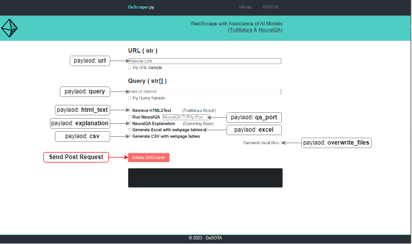

# About DeScraper
## Description
This project purpose is:
 - Connect with the AI models [NeuralQA](https://github.com/victordibia/neuralqa/) (Large Datasets Question Answer) and [Trafilatura](https://github.com/adbar/trafilatura/) (HTML2Text);
 - Generate HTML tables in Excel and/or CSV format with pandas.read_html.

## How it works
After instalation of this repository ([Windows](#Windows-Instalation)) and [NeuralQA](https://github.com/franciscomvargas/neuralqa) make your first request:

 - Begin by starting the API server ([Windows](###Start-API-server-(win)))

### By POST Request
You can use any programing language to make this request, I will use Python to ilustrate how you can do it:
```
import requests

descraper_url = "http://127.0.0.1:8880/api/scraper"

payload = {
    "url": "https://en.wikipedia.org/wiki/The_Simpsons",
    "html_text": True,
    "query": ["When the simpsons debut?"],
    "qa_port": 8888,
    "explanation": False,
    "excel": True,
    "csv": True
    "overwrite_files": False,
}

response = requests.request("POST", descraper_url, json=payload)

print(response.json())
```
#### **Payload Explanation**
|Parameter|Type|Optional|Description|
|---|---|---|---|
|url|string|&cross;|The link of the website to webscrape|
|html_text|bolean|&check;|Run Trafilatura - get text from webpage|
|query|array of strings|&check;|When running NeuralQA is required to specify what data you want to retrieve|
|qa_port|integer|&check;|NeuralQA is a TCP/Ip service runing in paralel, here is possible to specify it's Port. Default is 8888|
|explanation|bolean|&check;|Not implemented yiet but NeuralQA have the ability to explain the decisions made, this parameter will switch ON/OFF the output of this|
|excel|bolean|&check;|Generate Excel File with webpage tables|
|csv|bolean|&check;|Generate CSV Files with webpage tables|
|overwrite_files|bolean|&check;|DeScraper stores locally the scraped HTML pages and the Generated Tables, therefore, everytime you re-request the same URL you can overwrite the files switching ON this parameter (for example if the webpage has been updated)|

### By User Interface
 - [Open UI in the browser](###Open-UI-in-Browser)
 - Fill with payload parameters:




# Windows Instalation
## Create Project Folder 
Model Folder:
> %UserProfile%\Desota_Models\DeScraper

Go to CMD (command prompt)
> WIN + "R" 
> Write "cmd" 

Copy-Paste the following comands 
```
mkdir %UserProfile%\Desota_Models\DeScraper
cd %UserProfile%\Desota_Models\DeScraper

```

## Test if conda is instaled

Copy-Paste the following comands 
```
conda --version
```
if response is:
> 'conda' is not recognized as an internal or external command,operable program or batch 

then is required conda instalation !

### Conda Instalation
Copy-Paste the following comand
```
powershell -command "Invoke-WebRequest -Uri https://repo.anaconda.com/miniconda/Miniconda3-latest-Windows-x86_64.exe -OutFile ~\miniconda.exe && start /B /WAIT %UserProfile%\miniconda.exe /InstallationType=JustMe /AddToPath=0 /RegisterPython=0 /S /D=%UserProfile%\miniconda3 && del %UserProfile%\miniconda.exe 

```


## Install Descraper
Copy-Paste the following comands 
```
git clone https://github.com/franciscomvargas/descraper.git .
%UserProfile%\miniconda3\condabin\activate 
conda deactivate 
conda create --prefix ./env python=3.11 -y
conda activate ./env 
conda install -y pip
echo "yes" | pip install -r requirements.txt
echo DONE (:

```

## Run Model
### Start API server (win)
> Re-Open the command prompt (CMD)

Copy-Paste the following comands
```
cd %UserProfile%\Desota_Models\DeScraper
%UserProfile%\miniconda3\condabin\activate 
conda deactivate 
conda activate ./env 
python cli.py ui

```
## Open UI in Browser
Search in the browser
```
http://127.0.0.1:8880/
```

### Consideration
Some functionalities of this model require to run in paralel with neuralqa! 
> Take a look at [my neuralqa instalation repo](https://github.com/franciscomvargas/neuralqa)


# Credits / Lincense - Trafilatura
## Citation
```
@inproceedings{barbaresi-2021-trafilatura,
  title = {{Trafilatura: A Web Scraping Library and Command-Line Tool for Text Discovery and Extraction}},
  author = "Barbaresi, Adrien",
  booktitle = "Proceedings of the Joint Conference of the 59th Annual Meeting of the Association for Computational Linguistics and the 11th International Joint Conference on Natural Language Processing: System Demonstrations",
  pages = "122--131",
  publisher = "Association for Computational Linguistics",
  url = "https://aclanthology.org/2021.acl-demo.15",
  year = 2021,
}
```
## Licence
[GPL-3.0 license](https://github.com/adbar/trafilatura/blob/master/LICENSE)

